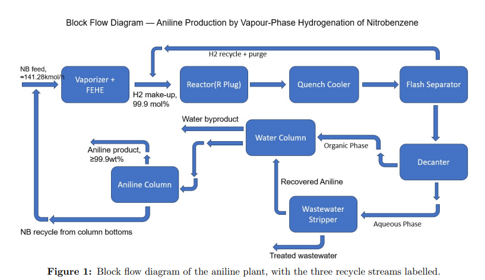
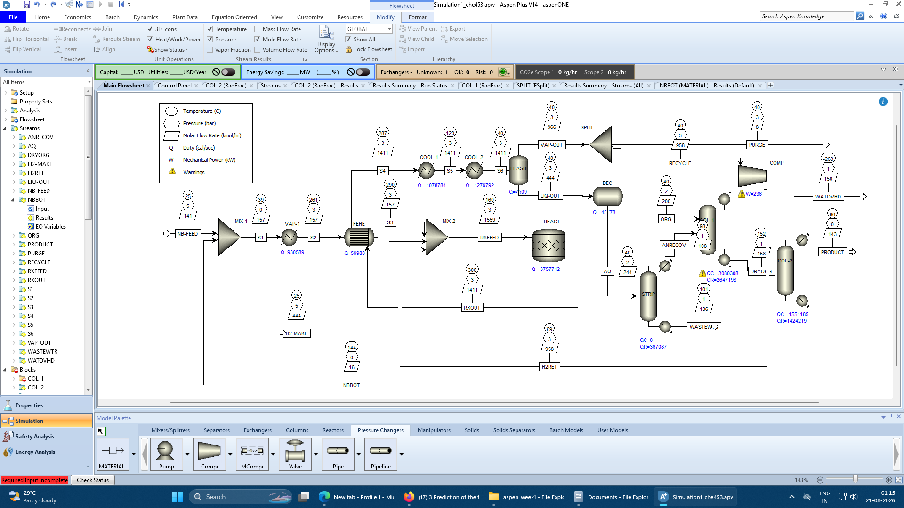

---

#  Production of Aniline by Vapour-Phase Catalytic Hydrogenation of Nitrobenzene

  <b>ChE453 – Capstone Project (Group 14)</b> 
  Department of Chemical Engineering, Indian Institute of Technology Kanpur

---

##  Project Overview

 This project presents the **design, simulation, and optimisation of a continuous industrial process** for the production of **Aniline** via the vapour-phase catalytic hydrogenation of **Nitrobenzene**.

Aniline (C₆H₅NH₂) is a bulk aromatic amine and a key intermediate of the organic chemical industry — about **85%** of world production feeds into MDI (methylene diphenyl diisocyanate) for rigid polyurethane foam, insulation panels, and adhesives, with the remainder going into rubber processing chemicals, agrochemicals, dyes, and pharmaceutical intermediates.

 The project evolves systematically from **process/route selection and material balance**, through **thermodynamic model validation and regression**, to **flowsheet development and convergence in Aspen Plus**, and now to **distillation column redesign, utility systems, and a captive power plant** — with material and energy balances closing tightly at every stage.

---

##  Reaction Chemistry

**Main Reaction:**

> C₆H₅NO₂ + 3 H₂ → C₆H₅NH₂ + 2 H₂O  (ΔHr ≈ −443 kJ/mol)

**Side Reactions (both proceed through aniline):**

> C₆H₅NH₂ + 3 H₂ → C₆H₁₃N  (over-hydrogenation to cyclohexylamine)
> C₆H₅NH₂ + H₂ → C₆H₆ + NH₃  (hydrogenolysis of the C–N bond)

 Key characteristics:

* Vapour-phase, catalytic (Cu or Ni supported catalyst), continuous operation
* Strongly exothermic — reaction heat release of **~17.6 MW** at design capacity, driving both a steam-recovery opportunity and a hot-spot/runaway risk
* Selectivity split (moles nitrobenzene reacted basis): **95% aniline : 1.5% cyclohexylamine : 3.5% benzene+ammonia** — recovered to design values in Report 3 (94.95 / 1.53 / 3.52%) after fixing an aniline-recycle defect
* Battery limits start from purchased nitrobenzene — nitration of benzene is outside project scope

---

##  Project Objectives

1) Identify and justify a suitable **industrial process route** for aniline production
2) Specify feed/product streams and close the **overall material balance**
3) Perform an **input–output cost analysis** as a preliminary economic screen
4) Select and validate an appropriate **thermodynamic model** (including in-house parameter regression)
5) Develop the **process flow diagram** and synthesis logic (recycle structure, separation sequencing)
6) Build, specify, and **converge the flowsheet in Aspen Plus**
7) Verify **material and energy balance closure** against hand calculations
8) Design and sequence the **distillation columns** to meet product specification
9) Design a **gas-turbine based captive power plant** and a **cooling water loop**
10) Perform **study-level utility costing**

---

##  Feed & Product Specifications

| Stream | Specification | Temp. | Pressure |
|--------|---------------|-------|----------|
| Aniline product | ≥ 99.9 wt%; water < 0.1 wt%; nitrobenzene < 5 ppm | 40 °C | 1.0 bar |
| Nitrobenzene feed | ≥ 99.5 wt%, technical grade | Ambient | 1.0 bar |
| Hydrogen make-up | 99.9 mol%, balance N₂ | Ambient | 5 bar |
| Treated wastewater | Aniline < 1 ppm before discharge | 40 °C | 1.0 bar |

**Design basis:**
- Plant capacity: **100,000 t/y** aniline, **8,000 h/y** operation (12.5 t/h)
- Nitrobenzene conversion per pass: **99%**
- Hydrogen-to-nitrobenzene molar ratio at reactor inlet: **10:1**

Market prices used in the economic screen (August 2026):
- Aniline: **Rs. 155,000/t** (≈ USD 1,631/t)
- Nitrobenzene: **Rs. 85,500/t** (bulk/term procurement target)
- Hydrogen: **Rs. 185,000/t** (on-site SMR production cost basis)

---

##  Process Development Summary

### 🧩 1. Process Identification, Material Balance & Thermodynamics (Report 1)

* **Route selected:** vapour-phase catalytic hydrogenation of nitrobenzene (Cu/Ni catalyst), chosen over liquid-phase hydrogenation, the Béchamp process, and phenol amination for its continuous operation, high selectivity (95–98%), clean by-product (water only), and recoverable reaction heat
* Overall material balance closed: **134.22 kmol/h** aniline product from **141.28 kmol/h** nitrobenzene reacted, with hydrogen loop (make-up, recycle, purge) balanced explicitly — purge ≈ 2% of make-up, carrying away ~1.9% of purchased hydrogen
* Reaction heat duty computed rigorously from actual reaction extents: **17.6 MW total** (main reaction 17,385 kW + side reactions 182 kW)
* Input–output economic screen: **gross contribution of Rs. 23,041/t aniline (14.9% margin)** — raw materials (mainly nitrobenzene, ~77% of revenue) dominate cost structure; screen passed
* **Thermodynamic model:** NRTL-RK selected (NRTL for liquid-phase activity coefficients, Redlich–Kwong for vapour); H₂ and N₂ declared as Henry components (supercritical at operating conditions)
* Default Aspen databank parameters for the ANILINE–WATER pair were found unreliable (sourced from a VLE bank despite being an LLE-splitting pair, and valid only over 99–168 °C versus the ~40 °C decanter operating point)
* **In-house NRTL regression performed** using NIST TDE binary LLE data (three-parameter fit, bⱼᵢ fixed at zero after diagnosing over-parameterisation in the initial four-parameter attempt)
* Regression validated independently against a held-out azeotropic data set: predicted azeotrope at **99.34 °C, x_aniline = 0.0368** vs. experimental **98.97 °C, x_aniline = 0.04** (agreement within 0.37 K)
* Confirmed a **heterogeneous aniline–water azeotrope**, meaning a decanter (not a distillation column) is required to break this pair

  

---

###  2. Flowsheet Development & Convergence in Aspen Plus (Report 2)

* Operating conditions fixed across all units: reactor at **300 °C, 3 bar** (catalyst operating window ~250–350 °C); flash/decanter at **40 °C** (bracketed by the regressed LLE data range of 39–70 °C)
* **Process synthesis logic:** vapour–liquid split taken first (flash), then liquid–liquid split (decanter) to break the aniline–water azeotrope for free, before handing the residue to distillation; three recycles identified — hydrogen gas recycle, unconverted nitrobenzene recycle, and recovered aniline recycle
* **Separation sequence:** DEC (decanter) → COL-1 (removes water-rich azeotrope overhead, three-phase RadFrac) → COL-2 (aniline overhead as product, nitrobenzene to bottoms/recycle, vacuum at 0.2–0.3 bar to avoid aniline darkening) → STRIP (atmospheric stripping of the aqueous phase)
* Full flowsheet built in Aspen Plus (RStoic reactor, Flash2, FSplit, Compr, Decanter, 3× RadFrac columns) and **converged with all three recycle loops closed** (Wegstein tear-stream convergence, max relative error 8.23×10⁻⁴)
* **Mass balance closure:** 0.7 kg/h in 18,300 kg/h (**0.004%**) | **Energy balance closure: 0.003%**
* Converged results matched the Report 1 hand balance closely (e.g., fresh nitrobenzene feed and hydrogen make-up agree exactly; reactor H₂:NB ratio settles at 9.12:1 due to recycle-gas nitrogen buildup, vs. 10:1 assumed)
* Product stream at this stage: **97.04 wt% aniline** (limited by residual water, cyclohexylamine, and nitrobenzene — still above the 5 ppm nitrobenzene spec), flagged for sharper column design in the next report
* Total heating **22.48 MW**, total cooling **45.16 MW**, against a **17.57 MW** reaction exotherm — heat integration beyond the single feed–effluent exchanger identified as future work

  

---

###  3. Distillation Redesign, Captive Power Plant & Utilities (Report 3)

Report 3 took up every defect flagged at the close of Report 2 — off-spec product, a physically meaningless COL-1 condenser, a mis-routed recovery stream, a missing pump — and added the utility systems (distillation redesign, cooling water loop, captive power plant, and study-level costing) as newly assigned objectives.

**Distillation column redesign:**
* **COL-1 (water column) rebuilt:** identified as an over-designed dryer (relative volatility water/aniline ≈ 100, Fenske minimum ≈ 3 stages) rather than a fractionator; cut from 20 to **12 stages**
* Replaced the physically invalid total condenser (which was driving to −263.15 °C to condense non-condensable H₂/N₂) with a **Partial-Vapor-Liquid condenser**, venting non-condensables separately; distillate vapour fraction of **0.10** adopted after the ANRECOV reroute made convergence possible
* A design specification on bottoms water content (**x_H2O = 0.002**) fixed the drying duty, raising the reboiler to 185.95 °C and requiring a shift from 10 bar to **16 bar steam**
* Diagnosed that aniline lost overhead **cannot be recovered by increasing reflux** — the overhead sits at the heterogeneous azeotrope itself, so the loss is thermodynamically fixed, not a rectification shortfall
* **ANRECOV rerouted** from COL-1 to the decanter (via a new condenser, ARCOND), removing a redundant internal water loop and shifting 7.18 MW of duty from expensive 16-bar steam to cheap cooling water (worth ≈ $334/h)
* **COL-2 (aniline column) re-specified** on a fixed bottoms rate (2 kmol/h, down from an oversized distillate:feed ratio of 0.9) — cut aniline returned to the reactor from 13.39 to 0.83 kmol/h and restored reactor selectivity to design values
* Tested and **rejected** two further COL-2 changes (higher reflux, higher bottoms cut) on cost–benefit grounds — duty rose sharply for negligible purity gain
* Diagnosed that a **cyclohexylamine side draw does not work**: cyclohexylamine and aniline have near-identical relative volatility despite a 49.6 K boiling-point gap, so no draw location separates them; flagged for resolution via improved catalyst selectivity (Report 4 kinetics) rather than separation
* **STRIP (wastewater stripper) boilup ratio raised from 1.0 to 3.0**, cutting residual aniline in wastewater by a factor of 177 (2135 → 154 ppm); still two orders of magnitude above the 1 ppm discharge limit, so a polishing step (activated carbon or biological treatment) is required downstream

**Key results (Report 3):**
* **Aniline recovery through separation: 98.09%** (up from 96.5% in Report 2)
* **Product: 99.39 wt% aniline, 0.04 wt% water**, delivered at the correct 40 °C / 1.0 bar (up from 97.04 wt% at 86.2 °C / 0.2 bar in Report 2)
* **Mass balance closure: 0.00006%** (0.01 kg/h in 18,300 kg/h) — an order-of-magnitude tightening versus Report 2
* **Energy balance closure: 0.005%**; total heating **20.40 MW**, total cooling **41.89 MW**

**Gas turbine captive power plant:**
* Sized on the plant purge stream (combustible fuel, LHV ≈ 0.61 MW) plus natural gas make-up, using an open Brayton cycle with exhaust heat recovery (Peng–Robinson property method, separate Aspen file)
* Turbine inlet temperature held near **1153.85 °C** (200% excess air) to stay within uncooled-blading limits; combustion modelled rigorously via a Gibbs-minimisation (RGibbs) block rather than assumed
* Rescaled from an initial oversized case to exactly match plant electrical demand: **709.1 kW net electrical** against a demand of **708.5 kW** (0.08% match)
* Simple-cycle thermal efficiency **31.1%** (consistent with commercial machines of this class); combined heat-and-power efficiency **82.7%** including 1.179 MW of HRSG steam recovery
* Combustion balance verified independently on carbon, oxygen, and completeness; CO₂ emissions **363 kg/h (2,900 t/y, 0.030 t CO₂ per tonne aniline)**
* CO and NOₓ chemistry flagged as unmodelled limitations (species not in the component slate) for future safety/environmental treatment

**Cooling water loop:**
* Circulation of **1,578 t/h** at a 12 K range (30 → 42 °C), verified independently by hand calculation and by Aspen Plus utility assignment (agreement within 0.39% overall)
* Tower water balance (evaporation, drift, blowdown, make-up) closed by hand: **43.6 t/h make-up** (2.8% of circulation, 349,000 t/y)
* Reactor duty (15.4 MW) and the COL-1 effluent cooler (4.4 MW) deliberately **excluded from cooling water** and left for steam-raising credit, consistent with Report 1's rationale for selecting the exothermic vapour-phase route
* Decanter duty found **infeasible on the main cooling-water header** (temperature cross at 40 °C operation vs. 42 °C water return) — correctly diagnosed by Aspen Plus and flagged for a trim/chilled-water or air-cooled exchanger

**Study-level utility costing:**
* Four utilities defined directly in Aspen Plus (CW, LP/MP/HP steam) and costed at Indian industrial rates
* **Thermal utility cost: USD 9.22 million/year**; total utility cost including electricity: **USD 9.73 million/year (≈ USD 99.4/t aniline)**
* Steam accounts for **97.3%** of thermal utility cost — confirms that hot-side duties, not cooling water, drive the utility bill
* The Report 3 stripper boilup decision alone is worth **USD 1.06 million/year**, identified as the single most valuable decision in the report
* A screening calculation shows recovering the COL-1 effluent-cooler duty (4.38 MW) as steam instead of rejecting it to cooling water could displace **≈USD 1.63 million/year (~18% of the thermal utility bill)** — deferred to the Report 5 pinch analysis for a rigorous check

  

---

## ⚙️ Key Technical Features (as of Report 3)

* Vapour-phase catalytic hydrogenation reactor (RStoic, 300 °C / 3 bar), 15.4 MW exotherm at converged conditions
* Hydrogen recycle loop with compressor and controlled purge (~0.87% split) to manage nitrogen build-up
* Decanter-first separation strategy exploiting the heterogeneous aniline–water azeotrope
* Redesigned 4-column separation train: Decanter → COL-1 (12-stage dryer, partial condenser) → COL-2 (vacuum, bottoms-rate specified) → Stripper (boilup ratio 3)
* In-house regressed NRTL-RK thermodynamic parameters (ANILINE–WATER pair), validated against independent azeotropic data
* Fully converged Aspen Plus flowsheet with three closed recycle loops, mass balance closing to 0.00006%
* Self-sufficient **gas-turbine captive power plant** (709.1 kW net) matched to plant electrical demand, with exhaust heat recovery
* **Cooling water loop** designed, sized, and cross-verified by hand and in Aspen Plus
* **Study-level utility costing** across steam and cooling water, identifying steam as 97.3% of the thermal utility bill

---

##  Economic Results

**Preliminary input–output screen (Report 1):**

| Metric | Value |
|--------|-------|
| Aniline revenue | Rs. 155,000/t |
| Total raw materials cost | Rs. 131,959/t |
| **Gross contribution** | **Rs. 23,041/t** |
| **Gross margin** | **14.9%** |

This screen considers raw materials only (nitrobenzene, hydrogen); utilities, labour, maintenance, and capital charges were excluded at this stage.

**Study-level utility costing (Report 3):**

| Metric | Value |
|--------|-------|
| Thermal utility cost | USD 9.22 million/year |
| Total utility cost (thermal + electrical) | USD 9.73 million/year |
| Utility cost per tonne aniline | ≈ USD 99.4/t |
| Steam share of thermal utility cost | 97.3% |
| Value of stripper boilup optimisation (Report 3 decision) | USD 1.06 million/year |
| Screening value of COL-1 waste-heat recovery (not yet implemented) | ≈ USD 1.63 million/year |

Full profitability metrics (capital cost, ROCE, NPV, IRR, payback) remain deferred to a later report once equipment costs and working capital are estimated.

---

##  Limitations & Objectives Carried Forward

**From Report 1:**
* Reactor performance (conversion/selectivity) is a specified assumption (RStoic block), not yet a kinetics-derived result
* Aniline–nitrobenzene NRTL pair has not yet been regressed (still on narrow-validity databank values, 83–99 °C)
* Economic screen rests on three externally sourced prices, pending confirmation via delivered quotations
* A third (unidentified) azeotrope appeared in the ternary aniline/water/nitrobenzene diagram after regression

**From Report 2:**
* Aniline–nitrobenzene pair regression still pending — directly affects COL-2, which runs at 144 °C, outside current databank validity
* Columns converged but not yet designed to meet product specification (99.9 wt% aniline, 5 ppm nitrobenzene)
* COL-1 used a physically invalid total condenser on a feed carrying non-condensables
* No pinch/heat-integration analysis or utility costing performed yet
* A pump was missing at the MIX-1 inlet

**From Report 3 (carried forward to Report 4/5):**
* **Aniline–nitrobenzene NRTL pair still not regressed** — now the most pressing outstanding item, since the COL-2 reboiler (153.15 °C) runs even further outside the 83–99 °C databank validity range than in Report 2; all COL-2 results, especially the product nitrobenzene content, remain provisional
* The **third ternary azeotrope** (flagged since Report 1) has still not been identified — an Azeotrope Search was not run this period
* **Aniline purity: 99.39 wt%** against a 99.9 wt% target — binding impurity is cyclohexylamine (0.42 wt%), which cannot be separated from aniline in either existing column due to near-identical relative volatility
* **Nitrobenzene in product: 1,466 ppm** against a 5 ppm target — requires more COL-2 stages or a third column, contingent on the pending NRTL regression
* **Aniline in wastewater: 154 ppm** against a 1 ppm target — equilibrium stripping cannot reach the limit at any practicable boilup; a polishing step (activated carbon/biological treatment) is required
* **Aniline lost in WATOVHD: 234 kg/h (1.9% of production)** — now the largest single aniline loss in the plant; lies inside the two-liquid-phase miscibility gap and is not treatable as ordinary wastewater; recovery via routing to the stripper or a second decanter is recommended for Report 4
* **Cyclohexylamine in wastewater: 3.7 wt%** — a larger discharge problem than residual aniline, only became visible once the stripper load increased; needs to be addressed alongside wastewater polishing
* **Heat integration beyond FEHE deferred** — a full pinch analysis of the network (including steam-raising from the reactor and COOL-1, and preheating the combined rather than partial reactor feed) is scheduled for Report 5
* The captive power plant was sized on the **Report 2 purge composition**; the Report 3-converged purge is slightly richer in fuel value and the power plant file needs to be re-run on the updated purge (expected to change net power by well under 1%)
* **VENT stream (COL-1 non-condensables, 262.6 kg/h)** requires a flare or thermal oxidiser — not yet costed or added to the equipment list
* CO and NOₓ formation in the gas turbine combustor are **not modelled** (species absent from the component slate) — flagged for future safety/environmental treatment

**Future work:**
* Kinetic parameter estimation for the reaction network, replacing the RStoic assumption (Report 4)
* Aniline–nitrobenzene NRTL regression and re-verification of the ternary azeotrope search
* Further distillation refinement (more COL-2 stages or a third column) to close the purity gap once regression is complete
* Wastewater polishing step design (aniline and cyclohexylamine)
* Recovery of the WATOVHD aniline loss
* Full pinch analysis and heat exchanger network (HEN) design, including reactor and COOL-1 heat recovery (Report 5)
* Re-run of the captive power plant on the updated purge composition
* Sensitivity analysis and full techno-economic evaluation (capital cost, NPV, IRR, payback)

---

##  Team Members (Group 14)

| Member | Roll No. |
|--------|----------|
| Nithin T M | 230709 |
| Aditya Nitin Patil | 230074 |
| Nithin D H | 230708 |
| Shubham Singh | 230999 |
| Shivam Dongare | 230971 |
| Sajag Masane | 230896 |

---

 *This repository documents the ongoing academic capstone project — from process/route selection and thermodynamic validation, through a converged Aspen Plus flowsheet, to distillation redesign, a captive power plant, and utility costing — with further reports to follow on reaction kinetics, the aniline–nitrobenzene regression, heat integration via pinch analysis, and final techno-economic evaluation.*

---
